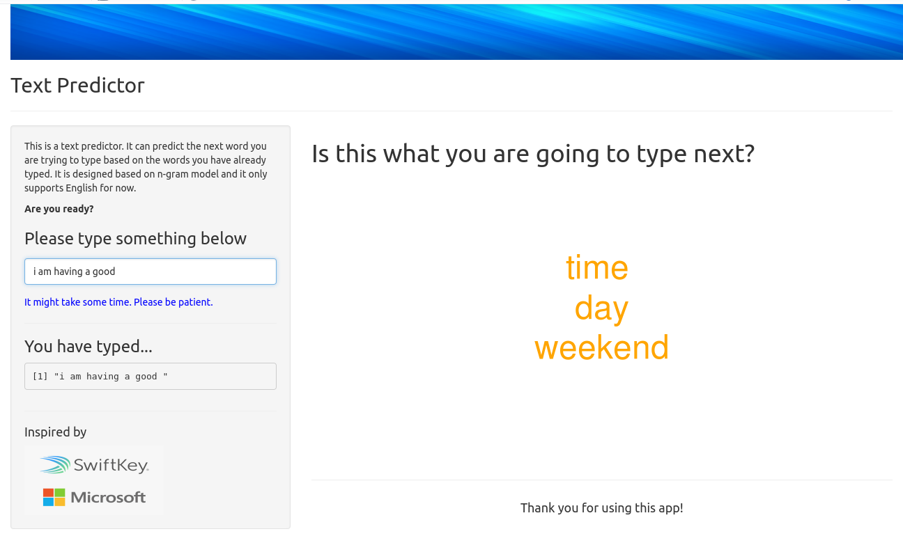
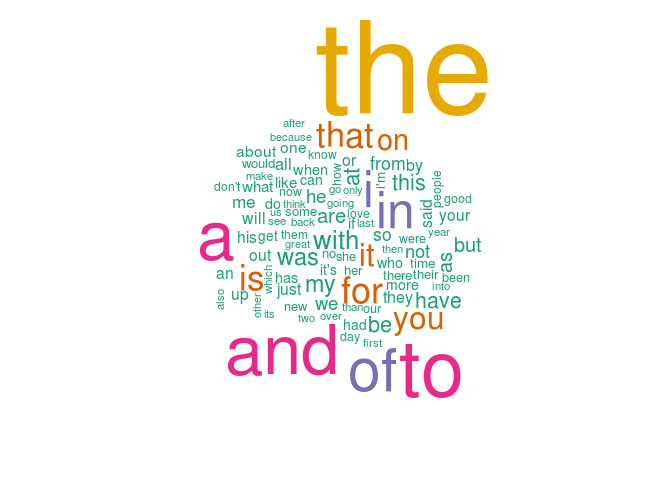

## Background  
  
As people around the world spend more and more time on their mobile devices, developing smart keyboards that could make typing easier becomes more and more desirable. For example, **Swiftkey** builds a smart keyboard which can present three options for what the next word might be based on what the user have typed.   

    

  

The goal of this project is:  
1. to understand the key to such smart keyboards, i.e., predictive text models   
2. to build a Shiny app to implement the models

--- .class #id 

## Shiny App: First Look  

    

  
The above shows the app user interface. The user can input some incomplete English sentences at the left which are also shown in the box below the typing area. Based on the user input, the app then outputs three words that are most likely to be what the user want to type next.     

--- .class #id 

## Shiny App: Behind the Scenes I

**Data**  
The data for building this app comes from a corpus called [HC Corpora](www.corpora.heliohost.org). The data are in the forms of English texts collected from twitters, blogs, and news. About 5% data of the original data are randomly selected for this app.  

**N-Gram**  
The prediction model is based on n-gram, which is a sequence of n words from a given text. In this app, n from 1 to 4 are used. Document term matrix for each n-gram is constructed to describe the frequency of each term. For example, the top 100 words in 1-gram are shown in the word cloud below (larger words are more frequent).  

    

--- .class #id 

## Shiny App: Behind the Scenes II

**Prediction Model: Backoff Algorithm**  
The app uses a so-called backoff algorithsm. The prediction starts with 4-gram by matching the last three words of the user input to the first three words of the 4-grams. It outputs the last word of the 4-grams whenever there is a match. It also calculates the frequency of that word (1/total number of matches).   

The algorithsm then backoffs to 3-gram and 2-gram to find the possible last words similarly. However, the calculated frequency of the potential word needs to be multiplied by a factor. For example, 0.4 for 3-gram, and $0.4^2$ for 2-gram in this case. The maximum likelihood estimate (MLE) of each candicate word is calculated with its overall frequency, and words with the largest MLE are selected as the  output.     

--- .class #id 

## More information

The app can be accessed at:  

https://yanfei-wu.shinyapps.io/text_predictor/  

The R code for data pre-processing, n-gram based prediction models, and shiny app can be accessed at:  

https://github.com/yanfei-wu/text_prediction_app 

